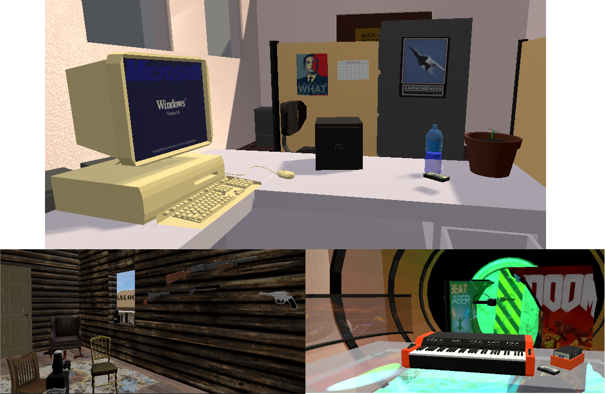

# Time Travel

> Voyagez dans le temps pour sauver le futur, dans cet escape game en réalité virtuelle.

## Prise en main

Ajouter le projet dans Unity Hub et lancez-le. Nos scripts sont dans `Scripts`, et nos modèles, textures, etc… sont dans `Resources`.

## Documentation

* Rapports des années précédentes qui détaillent le scénario, les fonctionalités qui devraient être ajoutées, les bugs, etc… : ["G1 - Time Travel 2019.pdf"](https://github.com/MichelQu/TimeTravel/blob/3731b56716ae27b97d2aaadbef9642a4885d75bb/G1%20-%20Time%20Travel%202019.pdf) (2019), 2020 ["Time-Travel-2020.pdf"](https://github.com/Aioshiro/TimeTravel/blob/master/Time-Travel-2020.pdf) et 2021 (à venir.)

* [Vue d'ensemble des scripts](docs/scripts.md)
* [Overview rapide du projet](docs/overview.md)

## À propos

Ce jeu est réalisé dans le cadre de l'option RV de Centrale Nantes. Il a été initialement conçu en 2019.
